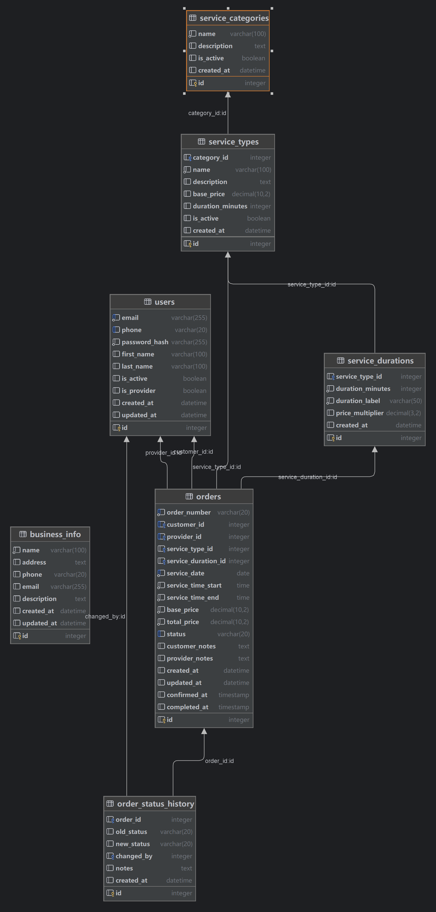
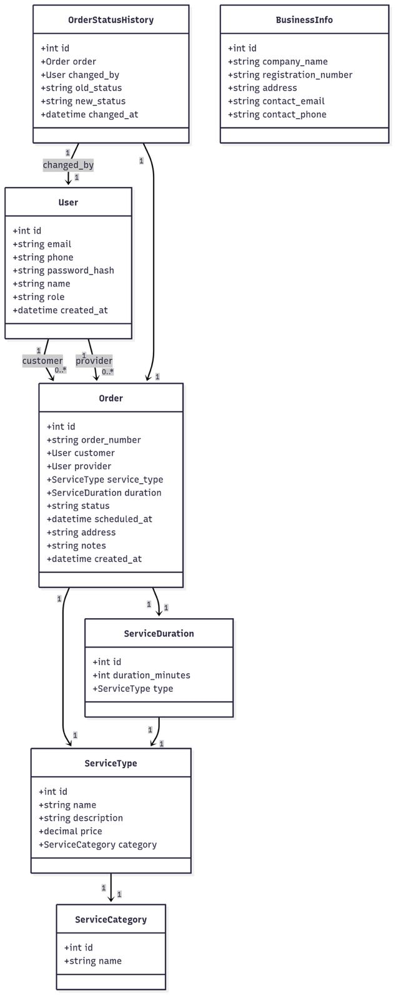

## Database Structure

The cleaning service platform uses SQLite with SQLAlchemy ORM. The database consists of three main entities:

1. **User** - Stores both customer and service provider information
2. **CleaningService** - Contains the service details offered by providers
3. **Appointment** - Manages the scheduling between customers and providers

### ER Diagram

### UML Diagram

### Prototype

#### Index

#### Login

#### Register

#### View Bookings
