# Actual iteration-1 board, (see chapters 3 and 4), add your start and end dates 

Checklist: 
1. github entry timestamps √
2. User stories are correct: see p39 √

* Assumed Velocity: 90 % 
* Number of developers: 4
* Total estimated amount of work: 16 days

User stories or tasks (see chapter 4):
1. [Customer Account Registration](./user_stories/user_stories.md), priority 10, 1.4 days
2. [Customer Account Login](./user_stories/user_stories.md), priority 10, 2 days
3. [Browse Cleaning Services](./user_stories/user_stories.md), priority 10, 5 days
4. [Book a Cleaning Service](./user_stories/user_stories.md), priority 10, 5 days 
5. [View Assigned Bookings](./user_stories/user_stories.md), priority 30, 2.5 days
<!-- 5. [Manage Provider Availability](./user_stories/user_stories.md), priority 10, 1.5 days -->
<!-- 6. [Provider Login](./user_stories/user_stories.md), priority 10, 1.5 days -->
<!-- 7. [Provider Account Registration](./user_stories/user_stories.md), priority 10, 1.5 days -->

In progress:
<!-- * Task-2 (Browse Cleaning Services), date started 18/06/2025
* Task-1 (Book a Cleaning Service), date started 18/06/2025
* Task-4 (View Assigned Bookings), date started 18/06/2025 -->
* No any tasks in progress

Completed:
* Task-1 (Customer Account Registration), date completed 08/06/2025
* Task-2 (Customer Account Login), date completed 08/06/2025
* Task-3 (Browse Cleaning Services), date completed 09/07/2025
* Task-4 (Book a Cleaning Service), date completed 09/07/2025
* Task-5 (View Assigned Bookings), date completed 09/07/2025

### Burn Down for iteration-1 (see chapter 4):
Update this at least once per week
* 1 weeks left, 5 days of estimated amount of work 
<!-- * 2 weeks left, xx days
* 1 weeks left, xx days
* 0 weeks left, xx days -->
* Actual Velocity: 1 

# Screemshots of completed work

### Index
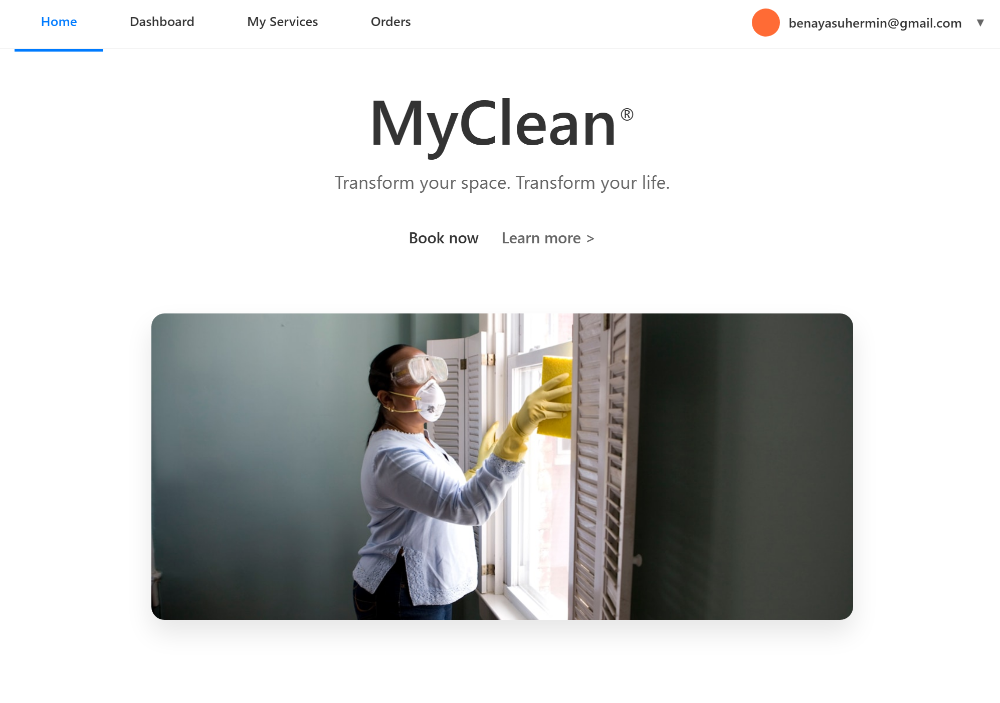

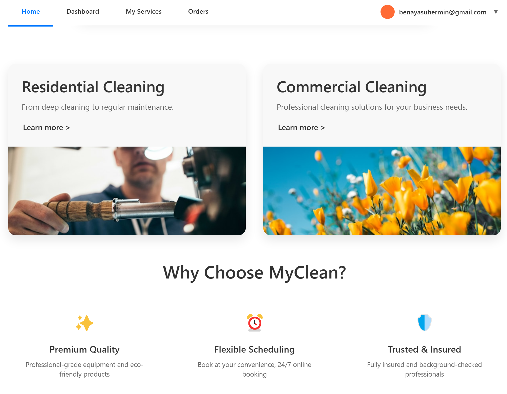

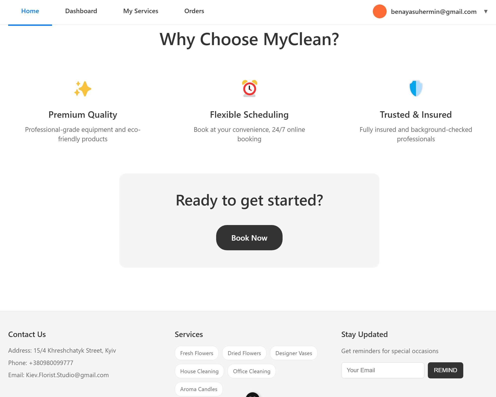

### Login
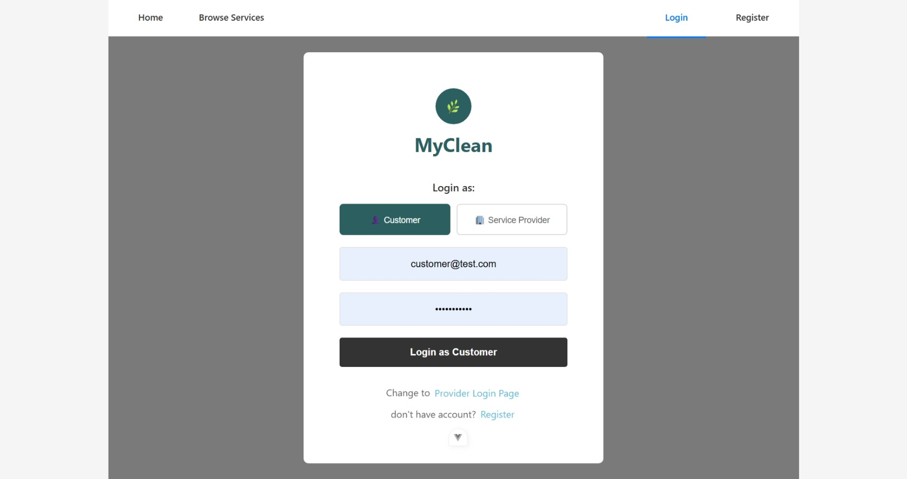

### Register
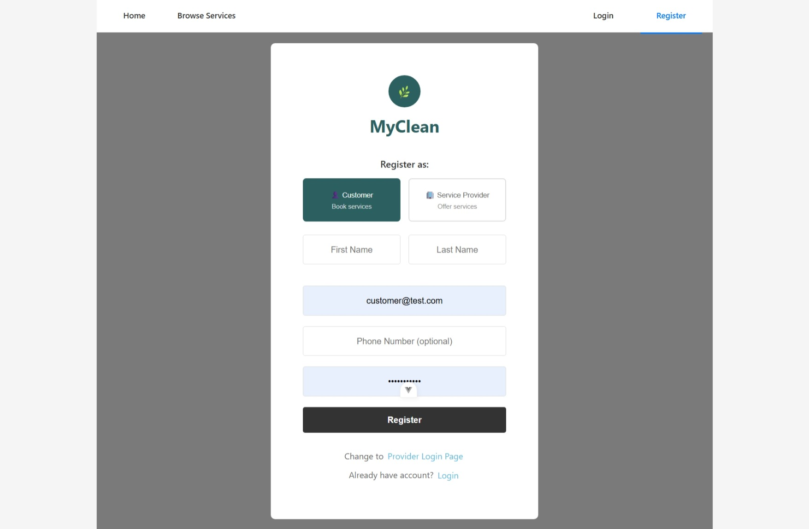

<!-- ### Service Type - Provider View
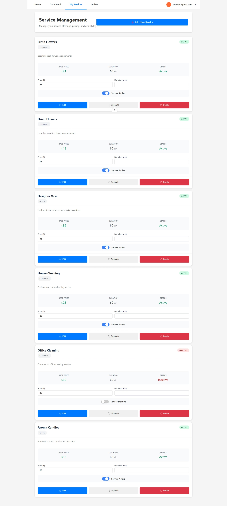 -->

### Browse Cleaning Services
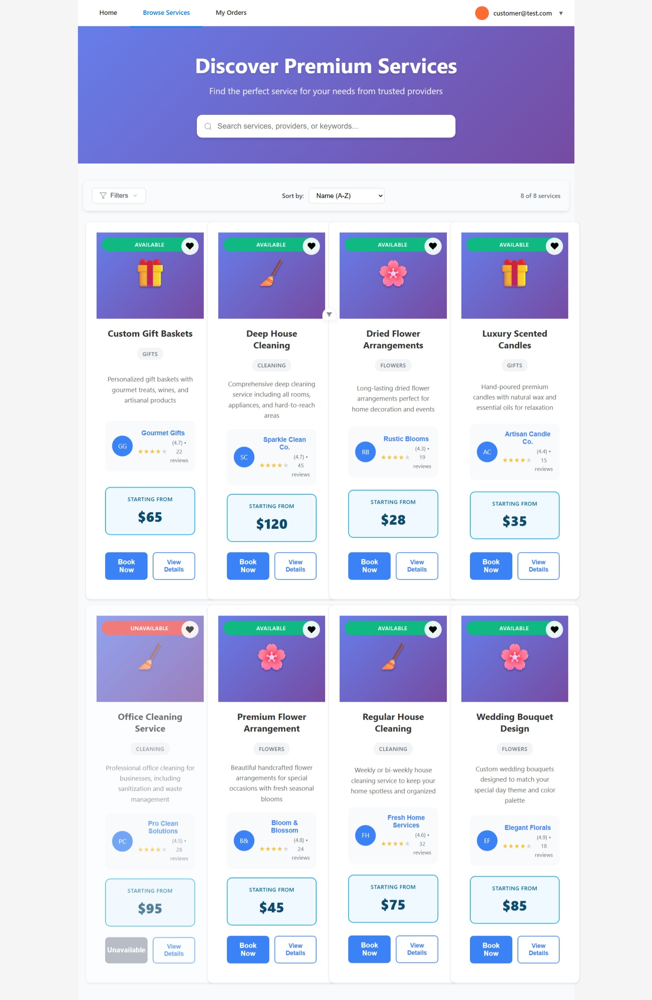

### Book a Cleaning Service
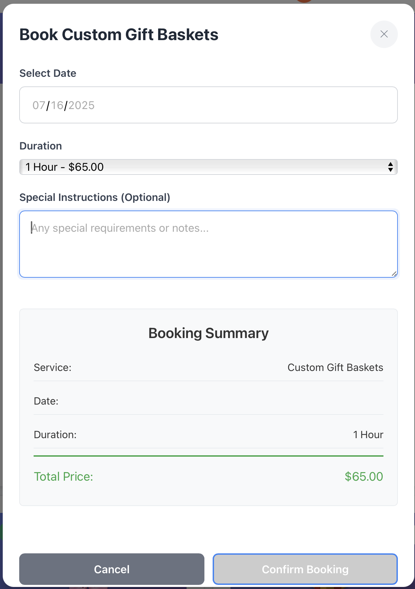

### View Assigned Bookings
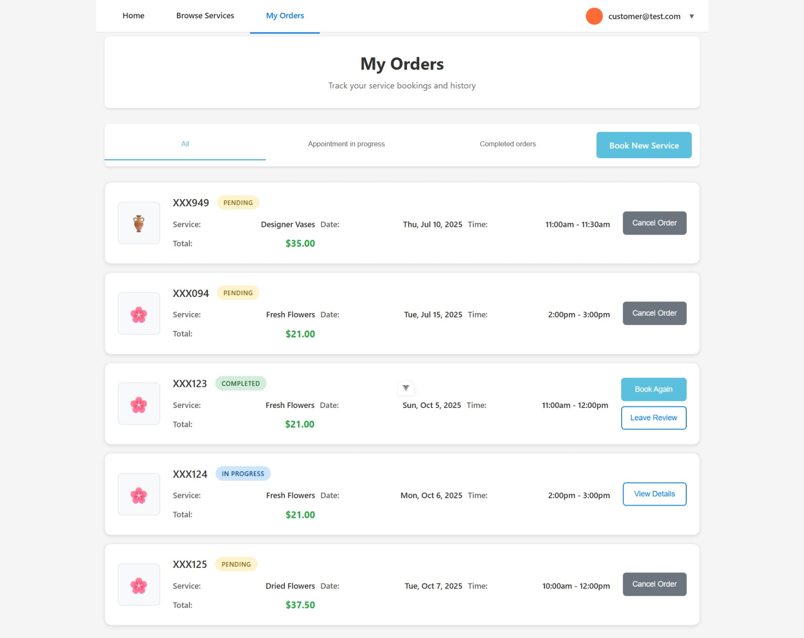

<!-- ### My Orders - provider view
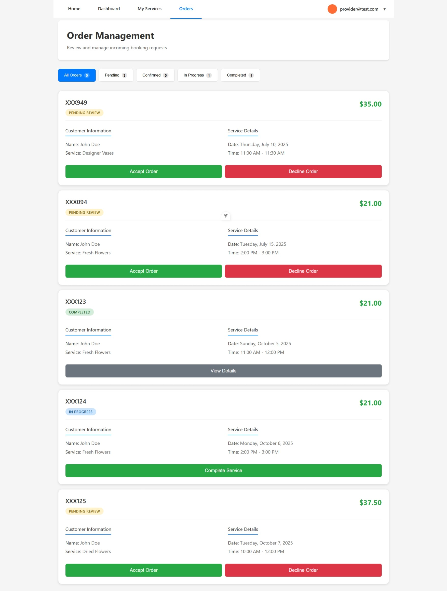

### Provider Dashboard
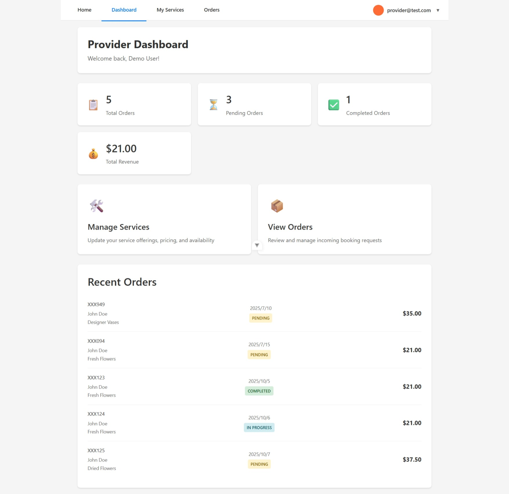 -->

