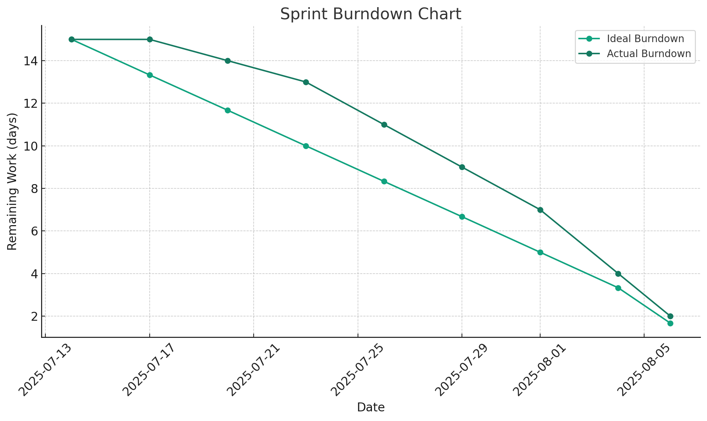
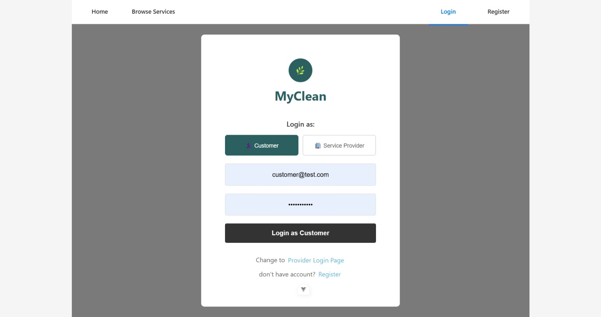
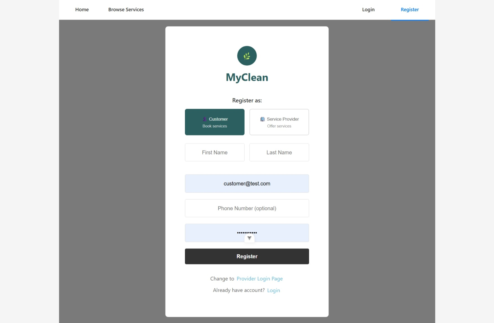
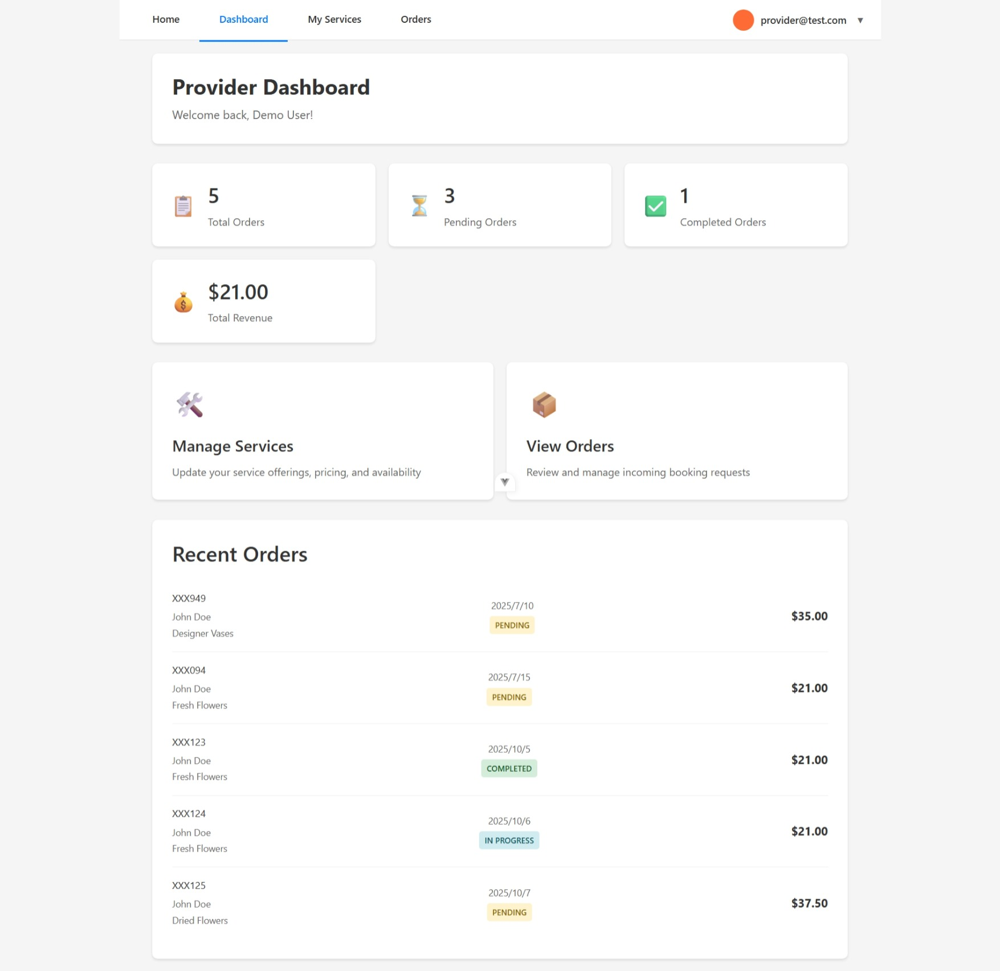
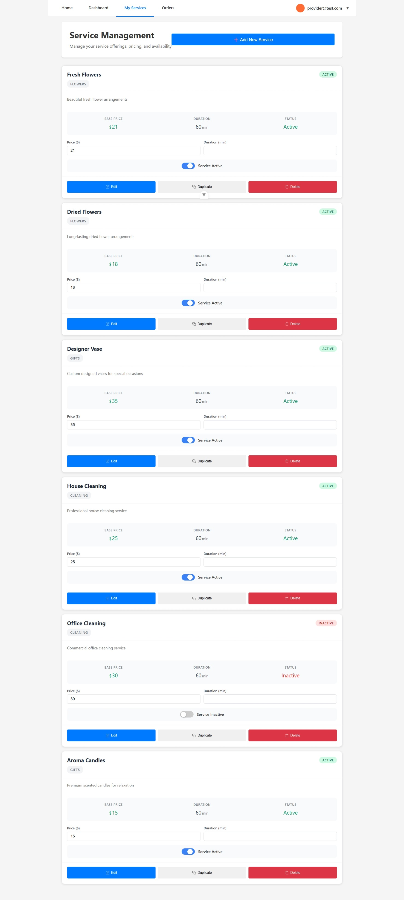
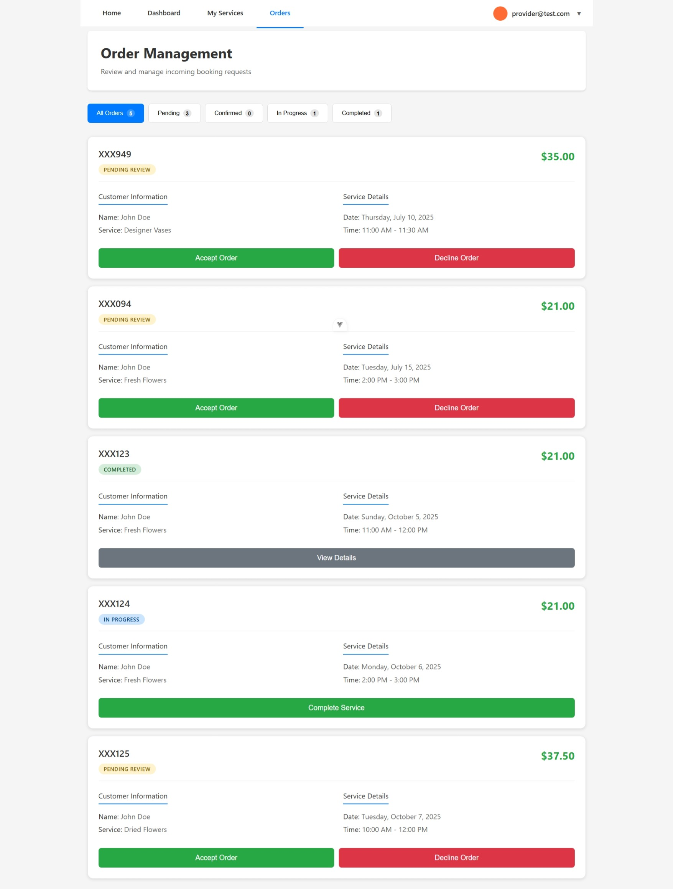

# Actual iteration-2 board, (see chapters 3 and 4), add your start and end dates 

Checklist: 
1. github entry timestamps √
2. User stories are correct: see p39 √

* Assumed Velocity: 90 % 
* Number of developers: 4
* Total estimated amount of work: 15 days

User stories or tasks (see chapter 4):
1. [Provider Account Registration](./user_stories/user_stories.md), priority 10, 5 days
2. [Provider Login](./user_stories/user_stories.md), priority 10, 4 days
3. [Manage Provider Availability](./user_stories/user_stories.md), priority 10, 5 days
 

<!-- 5. [Manage Provider Availability](./user_stories/user_stories.md), priority 10, 1.5 days -->
<!-- 6. [Provider Login](./user_stories/user_stories.md), priority 10, 1.5 days -->
<!-- 7. [Provider Account Registration](./user_stories/user_stories.md), priority 10, 1.5 days -->

In progress:
* Task-1 (Provider Account Registration), date started 14/07/2025
* Task-2 (Manage Provider Availability), date started 15/07/2025
* Task-3 (Provider Login), date started 17/07/2025
* No any tasks in progress

Completed:
* Task-1 (Provider Account Registration), date completed 23/07/2025
* Task-2 (Manage Provider Availability), date completed 23/07/2025
* Task-3 (Provider Login), date completed 30/07/2025

project task result:
* login in error
* cannot make a service as inactive
* creating a new service does not save to the database

### Burn Down for iteration-2 (see chapter 4):
Update this at least once per week
* 3 weeks left, 15 days of estimated amount of work 
* 2 weeks left, 10 days of estimated amount of work
* 1 weeks left, 5 days of estimated amount of work
<!-- * 0 weeks left, xx days -->
* Actual Velocity: 95% 

# Screemshots of completed work

### Index

### Provider Login

### Register

### Provider Dashboard

### Service Type - Provider View

### My Orders - provider view

